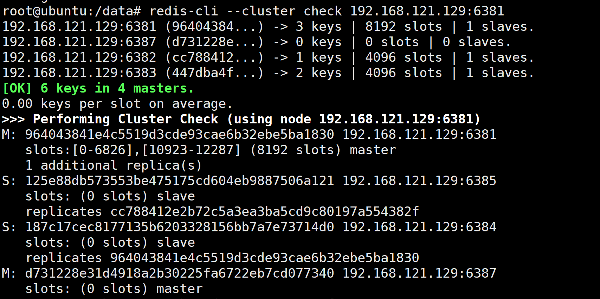

# redis主从缩容

[[toc]]

[toc]

**当流量高峰过去后我们就需要缩容了，删除7号和8号，恢复到3主3从**

> 我们需要原路返回嘛？又或者我们先删除6387还是先删除6388

**我们只能先删从机8号，因为master是负责写的，清出来的槽号重新分配，再删除7号**


## 检查集群状态获取8号机器noid

```
redis-cli --cluster check 192.168.121.129:6387
```


## 删除8号机器

+ **ip：从机端口**

+ **id：从机6388结点id**

```
redis-cli --cluster del-node ip:端口 id
```

**实现**

```python
root@ubuntu:/data# redis-cli --cluster del-node 192.168.121.129:6388 b1e31c7e33bf32bf880c8dd8a3c45053381acee3
>>> Removing node b1e31c7e33bf32bf880c8dd8a3c45053381acee3 from cluster 192.168.121.129:6388
>>> Sending CLUSTER FORGET messages to the cluster...
>>> Sending CLUSTER RESET SOFT to the deleted node.
```

> 此时8号被干掉了，我们继续清空槽号


## 清空槽号并且分配

```
redis-cli --cluster reshard 192.168.121.129:6381 
```

1. **此时我们需要将其除以四**

2. **先填入iD是1号结点的id**

3. **再填入的是7号将要删除结点id**
4. **最后填入的是node**



**可以看到1号结点占有的槽位两倍，7号没有槽位**


## 删除7号

```
redis-cli --cluster del-node ip:端口 id
```


```
root@ubuntu:/data# redis-cli --cluster del-node 192.168.121.129:6387 d731228e31d4918a2b30225fa6722eb7cd077340
>>> Removing node d731228e31d4918a2b30225fa6722eb7cd077340 from cluster 192.168.121.129:6387
>>> Sending CLUSTER FORGET messages to the cluster...
>>> Sending CLUSTER RESET SOFT to the deleted node.
root@ubuntu:/data# redis-cli --cluster check 192.168.121.129:6381 
192.168.121.129:6381 (96404384...) -> 3 keys | 8192 slots | 1 slaves.
192.168.121.129:6382 (cc788412...) -> 1 keys | 4096 slots | 1 slaves.
192.168.121.129:6383 (447dba4f...) -> 2 keys | 4096 slots | 1 slaves.
[OK] 6 keys in 3 masters.
0.00 keys per slot on average.
>>> Performing Cluster Check (using node 192.168.121.129:6381)
M: 964043841e4c5519d3cde93cae6b32ebe5ba1830 192.168.121.129:6381
   slots:[0-6826],[10923-12287] (8192 slots) master
   1 additional replica(s)
S: 125e88db573553be475175cd604eb9887506a121 192.168.121.129:6385
   slots: (0 slots) slave
   replicates cc788412e2b72c5a3ea3ba5cd9c80197a554382f
S: 187c17cec8177135b6203328156bb7a7e73714d0 192.168.121.129:6384
   slots: (0 slots) slave
   replicates 964043841e4c5519d3cde93cae6b32ebe5ba1830
M: cc788412e2b72c5a3ea3ba5cd9c80197a554382f 192.168.121.129:6382
   slots:[6827-10922] (4096 slots) master
   1 additional replica(s)
M: 447dba4f4813f9178d67e62488a4c4c5aba87635 192.168.121.129:6383
   slots:[12288-16383] (4096 slots) master
   1 additional replica(s)
S: 702a95b6eeb02a9d01d38152d599fdf57c70cf0c 192.168.121.129:6386
   slots: (0 slots) slave
   replicates 447dba4f4813f9178d67e62488a4c4c5aba87635
[OK] All nodes agree about slots configuration.
>>> Check for open slots...
>>> Check slots coverage...
[OK] All 16384 slots covered.
```

**此时大功告成！！！**

