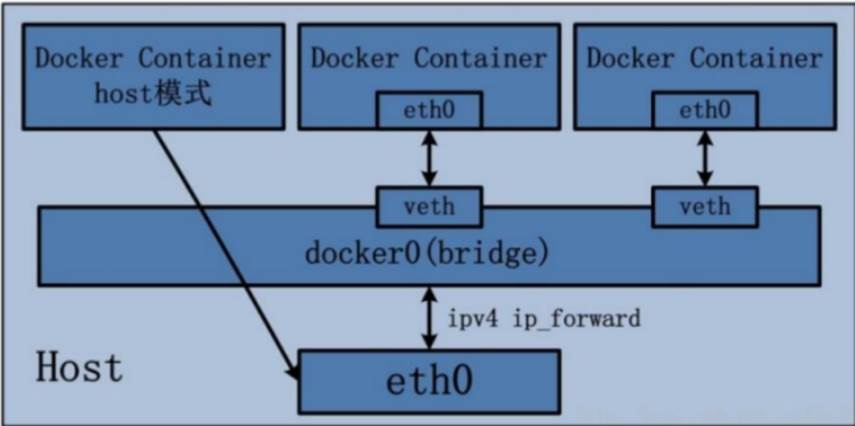

# host是什么

[[toc]]

[toc]

**直接使用宿主机的 IP 地址与外界进行通信，不再需要额外进行NAT 转换。**

**容器将不会获得一个独立的Network Namespace， 而是和宿主机共用一个Network Namespace。容器将不会虚拟出自己的网卡而是使用宿主机的IP和端口。**



**代码**

```
docker run -d -p 8083:8080 --network host --name tomcat83 billygoo/tomcat8-jdk8
```

::: warning 警告
**警告：不太推荐使用，`-p参数不起任何作用，因为是和主机公用一个端口`**


 :::

## 问题：

docke启动时总是遇见标题中的警告

## 原因：

**docker启动时指定--network=host或-net=host，如果还指定了-p映射端口，那这个时候就会有此警告，**

**并且通过-p设置的参数将不会起到任何作用，端口号会以主机端口号为主，重复时则递增。**

## 解决:

解决的办法就是使用docker的其他网络模式，例如`--network=bridge`，这样就可以解决问题，或者直接无视。。。。O(∩_∩)O哈哈~

## 正确

```
docker run -d --network host --name tomcat83 billygoo/tomcat8-jdk8
```

无之前的配对显示了，看容器实例内部

```
root@ubuntu:/home/smile# docker inspect tomcat83 | tail -n 20
            "Networks": {
                "host": {
                    "IPAMConfig": null,
                    "Links": null,
                    "Aliases": null,
                    "NetworkID": "c68651290784a6ed6e11337383cdc7d808ed42393675ade0b5c94fa368c2c556",
                    "EndpointID": "a228da421b411e51ada0066671c175938494c46a3915a67c5c3d24f05e73cf47",
                    "Gateway": "",
                    "IPAddress": "",
                    "IPPrefixLen": 0,
                    "IPv6Gateway": "",
                    "GlobalIPv6Address": "",
                    "GlobalIPv6PrefixLen": 0,
                    "MacAddress": "",
                    "DriverOpts": null
                }
            }
        }
    }
]
```

**没有设置-p的端口映射了，如何访问启动的tomcat83？？**

```
 "Gateway": "",
 "IPAddress": "",
```

```
http://宿主机IP:8080/
```

在CentOS里面用默认的火狐浏览器访问容器内的tomcat83看到访问成功，因为此时容器的IP借用主机的，

所以容器共享宿主机网络IP，这样的好处是外部主机与容器可以直接通信。

