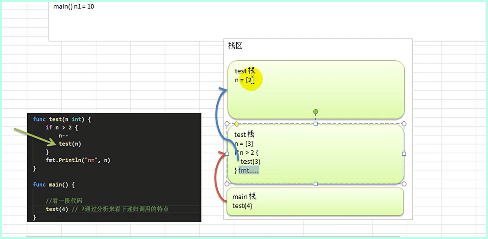
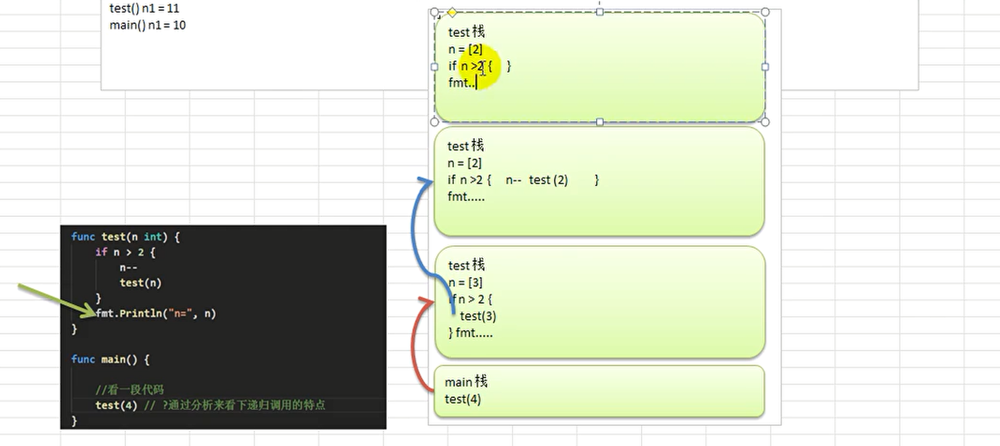
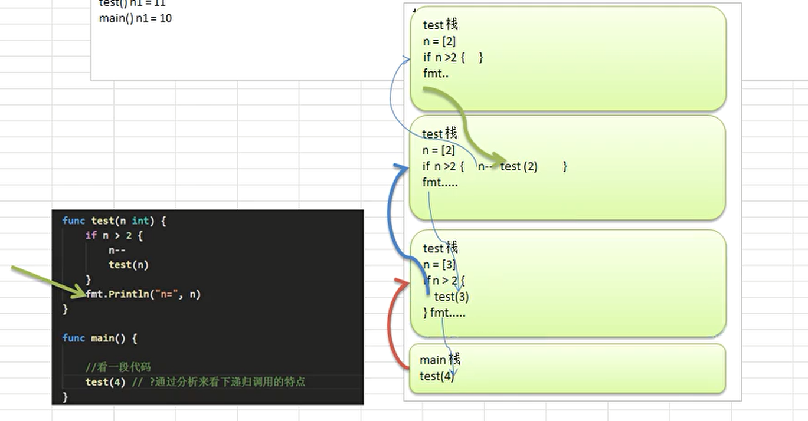
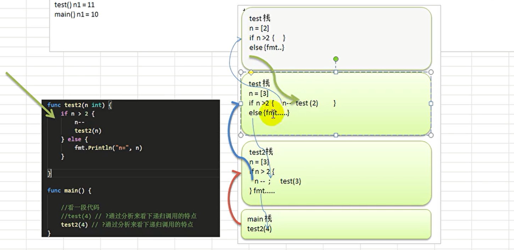
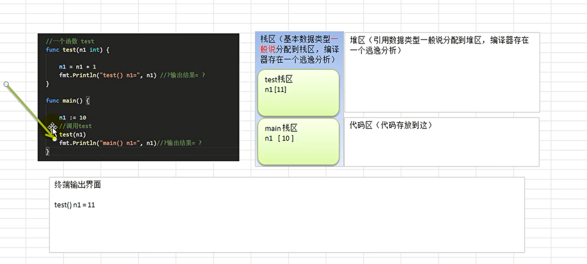
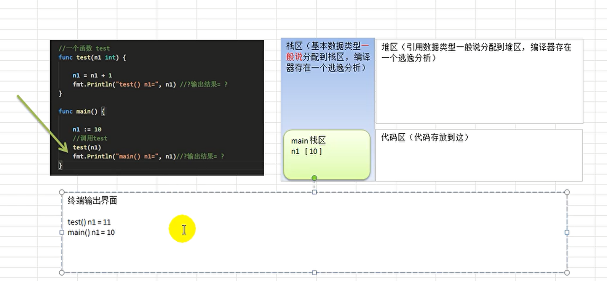
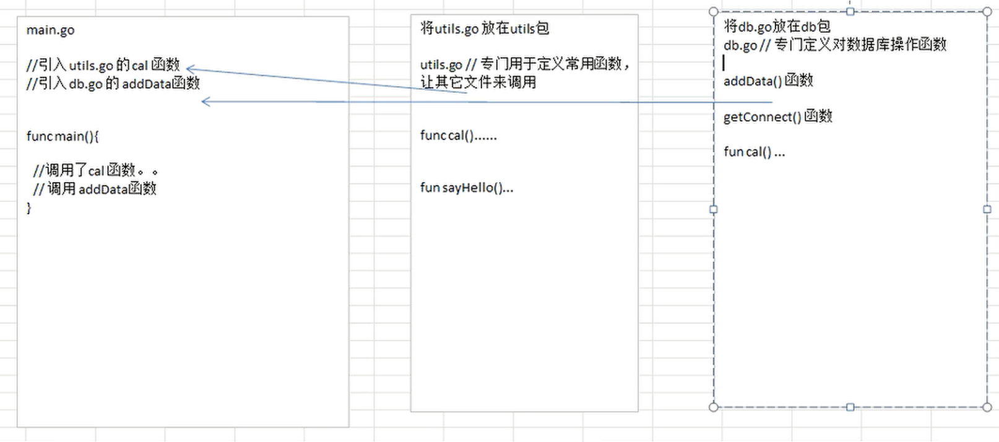
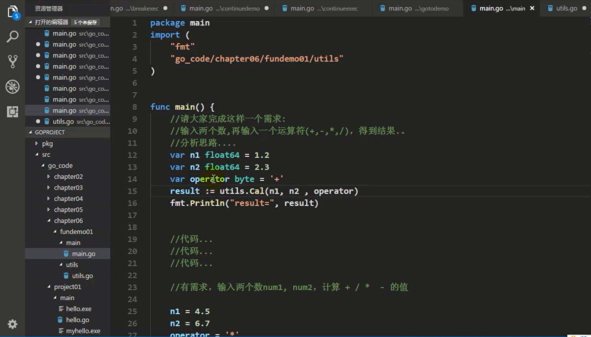
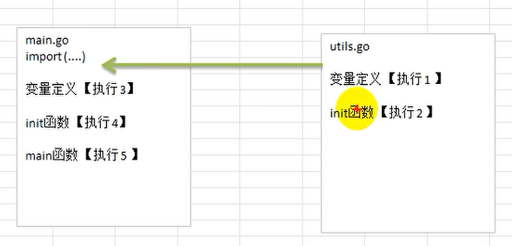

# 函数、init函数和包

[[toc]]

[toc]

😶‍🌫️go语言官方编程指南：[https://golang.org/#](https://golang.org/#)  

>   go语言的官方文档学习笔记很全，推荐去官网学习

😶‍🌫️我的学习笔记：github: [https://github.com/3293172751/golang-rearn](https://github.com/3293172751/golang-rearn)

**区块链技术（也称之为分布式账本技术）**，是一种互联网数据库技术，其特点是去中心化，公开透明，让每一个人均可参与的数据库记录

>   ❤️💕💕关于区块链技术，可以关注我，共同学习更多的区块链技术。博客[http://nsddd.top](http://nsddd.top)

## 函数

+ 函数是基本的代码块，用于执行一个任务。实现封装，使用调用。

+ Go 语言 **最少有个 main() 函数。**

+ 你可以通过函数来划分不同功能，逻辑上每个函数执行的是指定的任务。

+ 函数声明告诉了编译器函数的名称，返回类型，和参数。

+ Go 语言标准库提供了多种可动用的内置的函数。


> **例如：**
>
> len() 函数可以接受不同类型参数并返回该类型的长度。如果我们传入的是字符串则返回字符串的长度，如果传入的是数组，则返回数组中包含的元素个数。

**不一样的是：形参的话要先写函数名，再写类型**


### 函数定义

Go 语言函数定义格式如下：

```go
func function_name( [parameter list] ) [return_types] {
   函数体
}
```

#### 函数定义解析

-   `func`：函数由 func 开始声明
-   `function_name`：函数名称，参数列表和返回值类型构成了函数签名。
-   `parameter list`：参数列表，参数就像一个占位符，当函数被调用时，你可以将值传递给参数，这个值被称为实际参数。参数列表指定的是参数类型、顺序、及参数个数。参数是可选的，也就是说函数也可以不包含参数。
-   **`return_types`：返回类型，函数返回一列值。** `return_types` 是该列值的数据类型。有些功能不需要返回值，这种情况下 `return_types` 不是必须的。**可以有返回值，也可以没有**
-   **函数体：函数定义的代码集合。**


### return语句

1.   如果返回多个值时，在接受时，希望忽略某个返回值，则使用`_`表示忽略
2.   如果返回值只有一个，返回值类型列表可以不写`()`

>   以下实例为  max() 函数的代码，该函数传入两个整型参数 num1 和 num2，并返回这两个参数的最大值：

🔦**实例：**

```go
/* 函数返回两个数的最大值 */
func max(num1, num2 int) int {    //也可以用（）括起来
   /* 声明局部变量 */
   var result int

   if (num1 > num2) {
      result = num1
   } else {
      result = num2
   }
   return result
}
```

### 函数调用

当创建函数时，你定义了函数需要做什么，通过调用该函数来执行指定任务。

**调用函数，向函数传递参数，并返回值**，例如：

🔦**实例：**

```go
package main

import "fmt"

func main() {
   /* 定义局部变量 */
   var a int = 100
   var b int = 200
   var ret int

   /* 调用函数并返回最大值 */
   ret = max(a, b)

   fmt.Printf( "最大值是 : %d\n", ret )
}

/* 函数返回两个数的最大值 */
func max(num1, num2 int) int {
   /* 定义局部变量 */
   var result int

   if (num1 > num2) {
      result = num1
   } else {
      result = num2
   }
   return result
}
```

以上实例在 main() 函数中调用 max（）函数，执行结果为：

```
最大值是 : 200
```

### 函数返回多个值

**Go 函数可以返回多个值，和python相似**例如：

🔦**实例：**

```go
package main

import "fmt"

func swap(x, y string) (string, string) {   //两个返回值，此时一定要用（）括起来
   return y, x
}

func main() {
   a, b := swap("Google", "Runoob")
   fmt.Println(a, b)
}

//可以忽略返回值
/*
func swap(x, y string) (string, string) {   //两个返回值，此时一定要用（）括起来
   return y, x
}
func main() {
   _, b := swap("Google", "Runoob")    //注意看细节
   fmt.Println(a, b)
}
*/
```

以上实例执行结果为：

```
Runoob Google
```


### 递归调用

**函数调用本身,比较难**

```go
package main
import "fmt"

func test (n int) {
    if n > 2{
        n--
        test(n)
    }
    fmt.Println("n=",n)
}

func main(){
    test(4)
}
```

**当调用test（4）**

```
n = 2
n = 2
n = 3
```

**使用python代码来理解这块代码：**

```python
In [6]: def text(n):
   ...:     if n >2:
   ...:         n = n-1
   ...:         text(n)
   ...:     print("n=",n)
   ...:

In [7]: text(4)
n= 2
n= 2
n= 3
```


📜 对上面的解释：

**栈是先入后出的，**使用底层图解来描述代码执行



过程：

1.  **第一次递归调用的时候，后面的代码不执行，直接开始递归，开辟一个新的栈**

2.  此时n为3也是对if语句成立，继续执行n-- ,n为2，而且有一次递归，开辟一个新的独立空间

3.  此时n为2，if不成立,执行输出语句,输出n = 2,这个时候栈被回收,返回上一个栈

4.  上一个栈最后调用的时候n也是2,且在if语句中,那么此时依然会输出下面语句,然后销毁,返回上一个栈

5.  此时n保留了3,栈依旧回收返回main

    




整个过程:




再看一段代码:

```go
package main
import "fmt"

func test2 (n int) {
    if n > 2{
        n--
        test2(n)
    }else{
    fmt.Println("n=",n)
}

func main(){
    test2(4)
}
```

编译:

```
n = 2
```

经过上面的解释,这个结果就很容易理解了

**图解:**




### 递归总结:

1.   执行一个函数的时候,就创建了一个受保护的独立空间(新函数栈)
2.   函数的局部变量是独立的,不会相互影响
3.   递归要有出口，否则无线递归
4.   函数执行完毕或者遇见return会遵守谁调用,就将返回结果给谁,**同时,当函数执行完毕时,或者返回时,该函数本身也会被系统销毁(栈先进后出)**

🔦**实例：**

>   斐波拉数

```go
package main
import "fmt"

func fbn(n int) int{
    if(n == 1 || n == 2)
    return 1
   }else{
    return fbn(n-1) + fbn(n-2)
	}
}

func main(){
    fmt.Println("请输入一个数")
    fmt.Println()
    a := fmt.Scanln()
    i := fbn(a)
    fmt.Println("i = ",i)
}
```


### 函数调用的底层分析



**分析：main函数对应的栈区和test是两个独立的空间，此时当main调用test的时候，test中的n1从10变换到十一。当执行完终端输出的时候，此时函数调用完成，此时根据`cpu`的交互，test栈区就会被关闭空间了，编译器回收空间**



主函数执行完毕后，此时主函数的空间也被回收了，回收时main中空间n1还是10


## 函数 -- 包

::: danger 强烈推荐🔥
 ⚡[推荐mod教程，mod是Golang新出的包](https://github.com/3293172751/cs-awesome-Block_Chain/blob/master/Gomd_super/mod.md)

:::


**在开发中，可能会有成百上千的函数，我们可以选择用一个`.go`文件，或者多个文件（对数据库操作的函数或者是对不常用的函数封装、引入**

**或者是两个或者多个函数共同开发一个Go项目，此时在同一个文件里面定义相同的函数名会报错，但是如果是在两个多个多个文件包里，就不是冲突了**


::: tip
包的本质就是创建不同的文件夹，来存放不同的文件，而main是在main目录下，其他包是在其他的文件夹

:::


### 包示意图




### 包的使用

#### 作用

1.   区分相同名字的函数、变量等标识符
2.   当程序文件很多时，可以很好的管理项目
3.   **控制函数、变量等访问访问，即作用域**

#### 包的相关说明

**打包指令：**

```
package 包名
```

**引入一个包：**

```
import "包的路径"
```

**调用：**

```go
//函数名如果是小写，是不能挎包使用
//大写调用
包名.作用
```

>   我觉得一个文件夹开始是一个项目，里面还有一个main文件夹，里面包含`main.go`文件，这个可以称之为“main包”，与此相同的其他文件夹都可以是一个包。当其他包文件要想调用，里面的变量第一个字母需要大写（public），小写是私有



#### 注意

1.  包的路径：是从项目文件夹里面的第一层文件开始的，到该包（mod包不是）
2.  包名**最好**和文件夹名保持一致。
3.  **打包指令放在第一行，然后是`import`指令，然后是函数的执行**

4.   **如果包名比较长，Golang支持给包起别名，但是起别名之后原来的包不能使用**

     ```go
     import (
     	"fmt"
     	newutil "go_code/chapter/fundemo01/util"
     ) //注意：此时原来的包util不能再用了
     ```

5.   **如果两个相同函数名不在一个文件，但是在同一个包下，此时也会报错**
6.   **`main`包只有一个，而且只能是main可以形成可执行文件**


## 函数值传递

传递是指在调用函数时将实际参数复制一份传递到函数中，这样在函数中如果对参数进行修改，将不会影响到实际参数。

**默认情况下，Go 语言使用的是值传递，即在调用过程中不会影响到实际参数。**

❤️ **注意:和有些编程语言不同(JAVA),Golang的数组是使用的值传递,即不会改变实际参数**

**以下定义了 swap() 函数：**

```go
/* 定义相互交换值的函数 */
func swap(x, y int) int {
   var temp int

   temp = x /* 保存 x 的值 */
   x = y    /* 将 y 值赋给 x */
   y = temp /* 将 temp 值赋给 y*/

   return temp;
}
```

接下来，让我们使用值传递来调用 swap() 函数：

```go
package main

import "fmt"

func main() {
   /* 定义局部变量 */
   var a int = 100
   var b int = 200

   fmt.Printf("交换前 a 的值为 : %d\n", a )
   fmt.Printf("交换前 b 的值为 : %d\n", b )

   /* 通过调用函数来交换值 */
   swap(a, b)

   fmt.Printf("交换后 a 的值 : %d\n", a )
   fmt.Printf("交换后 b 的值 : %d\n", b )
}

/* 定义相互交换值的函数 */
func swap(x, y int) int {
   var temp int

   temp = x /* 保存 x 的值 */
   x = y    /* 将 y 值赋给 x */
   y = temp /* 将 temp 值赋给 y*/

   return temp;
}
```

以下代码执行结果为：

```
交换前 a 的值为 : 100
交换前 b 的值为 : 200
交换后 a 的值 : 100
交换后 b 的值 : 200
```

**程序中使用的是值传递, 所以两个值并没有实现交互，我们可以使用 引用传递 来实现交换效果。**


## 函数引用传递

**引用传递是指在调用函数时将实际参数的地址传递到函数中，那么在函数中对参数所进行的修改，将影响到实际参数。**

**引用传递指针参数传递到函数内，由于切片和map没有学到,以下是交换函数 swap() 使用指针方式实现引用传递：**

```go
/* 定义交换值函数*/
func swap(x *int, y *int) {
   var temp int
   temp = *x    /* 保持 x 地址上的值 */
   *x = *y      /* 将 y 值赋给 x */
   *y = temp    /* 将 temp 值赋给 y */
}
```

以下我们通过使用引用传递来调用 swap() 函数：

```go
package main

import "fmt"

func main() {
   /* 定义局部变量 */
   var a int = 100
   var b int= 200

   fmt.Printf("交换前，a 的值 : %d\n", a )
   fmt.Printf("交换前，b 的值 : %d\n", b )

   /* 调用 swap() 函数
   * &a 指向 a 指针，a 变量的地址
   * &b 指向 b 指针，b 变量的地址 */
        swap(&a, &b)
    
   fmt.Printf("交换后，a 的值 : %d\n", a )
   fmt.Printf("交换后，b 的值 : %d\n", b )
}

func swap(x *int, y *int) {
   var temp int
   temp = *x    /* 保存 x 地址上的值 */
   *x = *y      /* 将 y 值赋给 x */
   *y = temp    /* 将 temp 值赋给 y */
}
```

以上代码执行结果为：

```
交换前，a 的值 : 100
交换前，b 的值 : 200
交换后，a 的值 : 200
交换后，b 的值 : 100
```


## 在Golang语言中不支持函数的重载

::: details 重载和重写的区别
补充一些体外话题，就是Java中的重载和重写

+ 重载是对当前的包中的方法重载，返回值可以随意，参数的类型或者是参数个数一定不一样
+ 重写是对父类或者是父类开始重写，返回值一定要比父类的类型相同或者是子类，参数的列表必须一样，而且修饰符范围要相同或者扩大

:::


**Golang不允许同一个文件里函数名不同**

**在Go中,函数本身也是一种数据类型,,可以赋值给一个变量,该变量就是函数类型的变量,通过该变量实现对函数类型的调用**

🔦**实例：**

```go
package main
import "fmt"
func getSum(n1 int,n2,int)int{
    return n1 + n2
}

func main(){
    a := getSum
    fmt.Printf("a的类型是%T,getNum的类型是%T",a,getNum)
}   //%T 输出类型
```

**编译**

```
a的类型func(int,int)int
getSum的类型func(int,int)int
```


### 函数作为实参

🔦**实例：**:

```go
package main()

import (
	"fmt"
)

func getSum(n1 int,n2,int)int{
    return n1 + n2
}

func myFun(funvar func(int,int) int,num1 int,num2 int){
    return funvar(num1,num2)
}
func main(){
    a := getSum
    fmt.Printf("a的类型是%T,getNum的类型是%T",a,getNum)
	
    //看案例
    b := myFun(getSum,50,60)
    fmt.Println("b=",b)
}   //%T 输出类型
```


### Go语言可以自定义数据类型

基本语法:

```go
type 自定义数据类型名 数据类型         //相当于起别名
```

 

🔦**实例：**

```go
type myInt int

var num1 myInt
num1 = 40
```

**但是Go语言不认为int和myInt是相同类型,此时需要显示转换**

```
num2 := int(num1)
```

::: tip 📜 对上面的解释
其实就是类似于Java的`int`和`Intger`，一个是基本数据类型，默认是0，一个是引用类型（封装类），默认是空。

Integer变量必须要实例化后才能使用。

**比较**：

1.由于Integer变量实际上是对一个Integer对象的引用，所有两个通过new生成的Integer变量用比较永远是不相等的（new生成的是两个对象，内存地址不同，比较的是内存地址）。

```java
Integer num1 = new Integer(100);
Integer num2 = new Integer(100);
System.out.println(num1 == num2); // false，==比较的是内存地址
```

2.Integer变量和int变量比较时，只要两个变量的值是相等的，则结果为true（包装类Integer和基本数据类型int比较的时候，Java会自动拆箱为int，然后进行比较，实际上就变为两个int变量的比较）。

```java
Integer num1 = new Integer(100);
int num2 = 100;
System.out.println(num1 == num2); // true
```

3.非new生成的Integer变量和`new Integer()`生成的变量比较时，结果为false（非new生成的Integer变量指向的是Java常量池中的对象，而`new Integer()`生成的变量指向堆中新建的对象，两者在内存中的地址不同）。

```java
Integer num1 = new Integer(100);
Integer num2 = 100;
System.out.println(num1 == num2); // false
```

:::


### go语言支持对返回值命名

```go
func cal(n1 int,n2 int) (sum int, sub int){   //与1,2对应  --  与ab对应
    sum = n1 + n2   
	sub = n1 - n2
	return
}
func main(){
    a,b := cal(1,2)
    fmt.Printf("a = %v\n,b = %v\n",a,b)
}
```

**此时不需要 `:=`**

**这样做就没有对返回值顺序的要求了,推荐使用**


### GO 支持可变参数

#### 支持0到多个参数

```go
func sum(args...int) sum int{
}
```


#### 支持1到多个参数

```go
func sum(n1 int,args...int) sum int{
}
```

**说明:**

**1. `args`是`slice`切片,通过`args[index]`可以访问到各个值**

**2. 切片是一个动态的数组**

**3. 如果一个函数的形参列表中有可变参数,那么把可变参数放在最后**(类似于python、java)

🔦**实例：**

>   编写一个函数sum,可以求出1 到多个Int的和

```go
package main
import (
	"fmt"
)

func sum(n1 int,args... int)int{
    sum := n1
    //遍历args
    for i:= 0;i<len(args);i++{
        sum += args[i]
    }
    return sum
}

func main(){
    a := sum(10,234,3,4,34543,5,3,45,3,5,56)
    fmt.Println("a = ",a)
}
```

执行:


## init函数

>   go语言中和python一样拥有init函数

**每一个源文件中都可以包含一个init函数,该函数会在main函数执行前,被Go运行框架调用,也即是说init函数会在main函数执行前被调用**

即可以在init函数中实现初始化

🔦**实例：**

```go
func init(){
    fmt.Println("init先执行")
}
func main(){
    fmt.Println("main后执行")
}
```


### init细节

1.   如果有全局变量定义,那么最先执行的是全局变量,然后才是init函数,,最后是main函数
2.   init最主要的作用是完成初始化工作**(比如初始化全局变量)**

>    如果main.go 和 utils.go都包含了init时候,执行顺序是怎么样的



**即先执行引入文件的init函数,变量定义,然后执行main函数里面的变量定义....**


## 补充:python函数

### 定义函数

```python
def 函数名（）：
代码
```

**注意：python和Go一样，都是不支持函数的重载，但是python中不报错**


如果python有两个函数的函数名与参数列表都相同那么调用该函数时，哪个函数在后，则哪个被最终调用。

💡简单的一个案例如下：

```python
def test():
    print "before hello"

def test():
    print "after hello"

if __name__ == '__main__':
    test()
```

**结果：**


**在函数中修改全局变量：** 

```
global a  ---- 定义a是全局的变量
```


### 不带参数值的 return 语句返回 None

💡简单的一个案例如下：

```python
# -*- coding: UTF-8 -*-
 
 def sum(num1,num2):
     # 两数之和
     if not (isinstance (num1,(int ,float)) and isinstance (num2,(int ,float))):
         raise TypeError('参数类型错误')  #条件语句中用and或者or判断
     return num1+num2
 
 print(sum(1,2))
```

🚀 编译结果如下：

```
3
```

这个示例，还通过内置函数`isinstance(`)进行数据类型检查，检查调用函数时参数是否是整形和浮点型。如果参数类型不对，会报错，提示 参数类型错误**当然，函数也可以返回多个值，具体实例如下：**

```python
# -*- coding: UTF-8 -*-
 
 def division ( num1, num2 ):
     # 求商与余数
     a = num1 % num2
     b = (num1-a) / num2
     return b , a
 
 num1 , num2 = division(9,4)
 tuple1 = division(9,4)
 
 print (num1,num2)
 print (tuple1)
```

**输出的值：**

```
 2.0 1
 (2.0, 1)
```

认真观察就可以发现，尽管从第一个输出值来看，返回了多个值，实际上是先创建了一个元组然后返回的。

回忆一下，元组是可以直接用逗号来创建的，观察例子中的 ruturn ，可以发现实际上我们使用的是逗号来生成一个元组。

Python 语言中的函数返回值可以是多个，这是Python 相比其他语言的简便和灵活之处。

**Python 一次接受多个返回值的数据类型就是元组。**


### python的变量使用

为了避免局部变量和全局变量出现混淆，有些公司要求加g_或者gl_的前缀。 `global ：全局变量`

+ 函数返回类型，如果要接受的话一般用元组

+ 元组是一个不可变的类型，**访问的时候使用下标**


接受元组的时候，**可以使用多个变量接受返回元组的函数，这个时候使用逗号分隔。**

```python
gl_temp,gl_wetness = measure()

#第0个元素传递给第一个变量

#注意的是：使用多个变量接受结果的时候，变量的个数和元组中元素的个数应该保持一致。
```

在python中，列表变量调用+=的本质是在执行变量列表的extend方法，不会修改变量的引用。

即列表是可以修改的，不会相加再赋值，而是直接把另一个列表整合


## END 链接

<ul><li><div><a href = '4.md' style='float:left'>⬆️上一节🔗</a><a href = '6.md' style='float: right'>⬇️下一节🔗</a></div></li></ul>

+ [Ⓜ️回到目录🏠](../README.md)

+ [**🫵参与贡献💞❤️‍🔥💖**](https://nsddd.top/archives/contributors))

+ ✴️版权声明 &copy; :本书所有内容遵循[CC-BY-SA 3.0协议（署名-相同方式共享）&copy;](http://zh.wikipedia.org/wiki/Wikipedia:CC-by-sa-3.0协议文本) 

