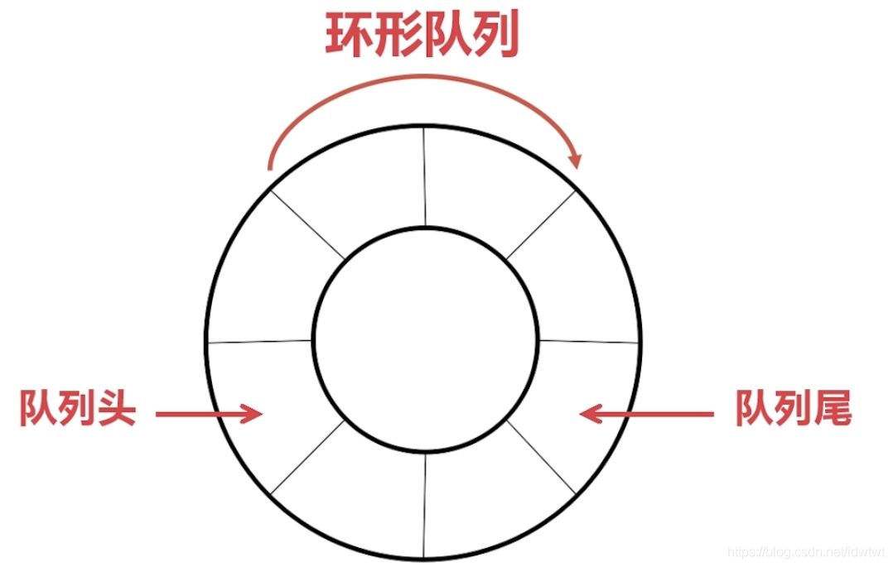

# chan环形队列 先进先出

[toc]

😶‍🌫️go语言官方编程指南：[https://golang.org/#](https://golang.org/#)  

>   go语言的官方文档学习笔记很全，推荐去官网学习

😶‍🌫️我的学习笔记：github: [https://github.com/3293172751/golang-rearn](https://github.com/3293172751/golang-rearn)

---

**区块链技术（也称之为分布式账本技术）**，是一种互联网数据库技术，其特点是去中心化，公开透明，让每一个人均可参与的数据库记录

>   ❤️💕💕关于区块链技术，可以关注我，共同学习更多的区块链技术。博客[http://nsddd.top](http://nsddd.top)

## 1.1 环形缓冲区结构

​       环形缓冲区通常有一个读指针和一个写指针。读指针指向环形缓冲区中可读的数据，写指针指向环形缓冲区中可写的缓冲区。通过移动读指针和写指针就可以实现缓冲区的数据读取和写入。在通常情况下，环形缓冲区的读用户仅仅会影响读指针，而写用户仅仅会影响写指针。如果仅仅有一个读用户和一个写用户，那么不需要添加互斥保护机制就可以保证数据的正确性。如果有多个读写用户访问环形缓冲区，那么必须添加互斥保护机制来确保多个用户互斥访问环形缓冲区。

## 1.2 环形缓冲区一种读写实现机制
一般的，圆形缓冲区需要4个指针

在内存中实际开始位置；

**在内存中实际结束位置，也可以用缓冲区长度代替；**

**存储在缓冲区中的有效数据的开始位置（读指针）；**

**存储在缓冲区中的有效数据的结尾位置（写指针）。**

缓冲区是满、或是空，都有可能出现读指针与写指针指向同一位置：

缓冲区中总是有一个存储单元保持未使用状态。缓冲区最多存入（size-1）个数据。如果读写指针指向同一位置，则缓冲区为空。如果写指针位于读指针的相邻后一个位置，则缓冲区为满。




## 2 chan内部数据结构

### 2.1 chan的数据结构

**chan实质是个环形缓冲区，外加一个接受者协程队列和一个发送者协程队列**

```
buf      ：环形缓冲区
sendx ：用于记录buf这个循环链表中的发送的index
recvx  ：用于记录buf这个循环链表中接收的index
recvq  ：接受者协程队列
sendq ：发送者协程队列
lock    ：互斥锁
```


### 2.2 有缓冲区和无缓冲区chan的区别
##### 2.2.1 无缓冲chan数据同步过程和sudog结构
创建一个发送者列表和接收者列表都为空的 channel。
第一个协程向 channel 发送变量的值
channel 从池中获取一个sudog结构体变量，用于表示发送者。sudog 结构体会保持对发送者所在协程的引用，以及发送变量的引用。
发送者加入sendq队列。
发送者协程进入等待状态。
第二个协程将从 channel 中读取一个消息
channel 将sendq列表中等待状态的发送者出队列。
chanel 使用memmove函数将发送者要发送的值进行拷贝，包装入sudog结构体，再传递给 channel 接收者的接收变量。
在第五步中被挂起的第一个协程将恢复运行并释放第三步中获取的sudog结构体。

##### 2.2.1 有缓冲chan

有缓冲chan实质是使用了完整的环形缓冲区，只要缓冲区有空闲，则发送者无需进入等待队列，直接将数据放入环形缓冲区中，如果缓冲区有数据，接受者无需进入等待队列，直接从环形缓冲区中获取数据。

## 3 关键源码分析

### 3.1 chan数据结构源码

```go
type hchan struct {
	qcount   uint           // total data in the queue
	dataqsiz uint           // size of the circular queue
	buf      unsafe.Pointer // points to an array of dataqsiz elements
	elemsize uint16
	closed   uint32
	elemtype *_type // element type
	sendx    uint   // send index
	recvx    uint   // receive index
	recvq    waitq  // list of recv waiters
	sendq    waitq  // list of send waiters
// lock protects all fields in hchan, as well as several
// fields in sudogs blocked on this channel.
//
// Do not change another G's status while holding this lock
// (in particular, do not ready a G), as this can deadlock
// with stack shrinking.
lock mutex
}
```
### 3.2 sudog数据结构源码

```go
// sudog represents a g in a wait list, such as for sending/receiving
// on a channel.
//
// sudog is necessary because the g ↔ synchronization object relation
// is many-to-many. A g can be on many wait lists, so there may be
// many sudogs for one g; and many gs may be waiting on the same
// synchronization object, so there may be many sudogs for one object.
//
// sudogs are allocated from a special pool. Use acquireSudog and
// releaseSudog to allocate and free them.
type sudog struct {
	// The following fields are protected by the hchan.lock of the
	// channel this sudog is blocking on. shrinkstack depends on
	// this for sudogs involved in channel ops.
g 		*g
// isSelect indicates g is participating in a select, so
// g.selectDone must be CAS'd to win the wake-up race.
isSelect bool
next     *sudog
prev     *sudog
elem     unsafe.Pointer // data element (may point to stack)
 
// The following fields are never accessed concurrently.
// For channels, waitlink is only accessed by g.
// For semaphores, all fields (including the ones above)
// are only accessed when holding a semaRoot lock.
 
acquiretime int64
releasetime int64
ticket      uint32
parent      *sudog // semaRoot binary tree
waitlink    *sudog // g.waiting list or semaRoot
waittail    *sudog // semaRoot
c           *hchan // channel
}
```
### 3.3 chan的构造过程

```go
func makechan(t *chantype, size int) *hchan {
	elem := t.elem
// compiler checks this but be safe.
if elem.size >= 1<<16 {
	throw("makechan: invalid channel element type")
}
if hchanSize%maxAlign != 0 || elem.align > maxAlign {
	throw("makechan: bad alignment")
}
 
mem, overflow := math.MulUintptr(elem.size, uintptr(size))
if overflow || mem > maxAlloc-hchanSize || size < 0 {
	panic(plainError("makechan: size out of range"))
}
 
// Hchan does not contain pointers interesting for GC when elements stored in buf do not contain pointers.
// buf points into the same allocation, elemtype is persistent.
// SudoG's are referenced from their owning thread so they can't be collected.
// TODO(dvyukov,rlh): Rethink when collector can move allocated objects.
var c *hchan
switch {
case mem == 0:
	// Queue or element size is zero.
	c = (*hchan)(mallocgc(hchanSize, nil, true))
	// Race detector uses this location for synchronization.
	c.buf = c.raceaddr()
case elem.ptrdata == 0:
	// Elements do not contain pointers.
	// Allocate hchan and buf in one call.
	c = (*hchan)(mallocgc(hchanSize+mem, nil, true))
	c.buf = add(unsafe.Pointer(c), hchanSize)
default:
	// Elements contain pointers.
	c = new(hchan)
	c.buf = mallocgc(mem, elem, true)
}
 
c.elemsize = uint16(elem.size)
c.elemtype = elem
c.dataqsiz = uint(size)
 
if debugChan {
	print("makechan: chan=", c, "; elemsize=", elem.size, "; dataqsiz=", size, "\n")
}
return c
}
```

可以看到，如果不传入size或size=0，则没有为环形缓冲区分配内存，职位chan结构分配内存

### 3.4 无缓冲收发

```go
// Sends and receives on unbuffered or empty-buffered channels are the
// only operations where one running goroutine writes to the stack of
// another running goroutine. The GC assumes that stack writes only
// happen when the goroutine is running and are only done by that
// goroutine. Using a write barrier is sufficient to make up for
// violating that assumption, but the write barrier has to work.
// typedmemmove will call bulkBarrierPreWrite, but the target bytes
// are not in the heap, so that will not help. We arrange to call
// memmove and typeBitsBulkBarrier instead.

func sendDirect(t *_type, sg *sudog, src unsafe.Pointer) {
	// src is on our stack, dst is a slot on another stack.
	// Once we read sg.elem out of sg, it will no longer
	// be updated if the destination's stack gets copied (shrunk).
	// So make sure that no preemption points can happen between read & use.
	dst := sg.elem
	typeBitsBulkBarrier(t, uintptr(dst), uintptr(src), t.size)
	// No need for cgo write barrier checks because dst is always
	// Go memory.
	memmove(dst, src, t.size)

}

func recvDirect(t *_type, sg *sudog, dst unsafe.Pointer) {
	// dst is on our stack or the heap, src is on another stack.
	// The channel is locked, so src will not move during this
	// operation.
	src := sg.elem
	typeBitsBulkBarrier(t, uintptr(dst), uintptr(src), t.size)
	memmove(dst, src, t.size)
}
```


