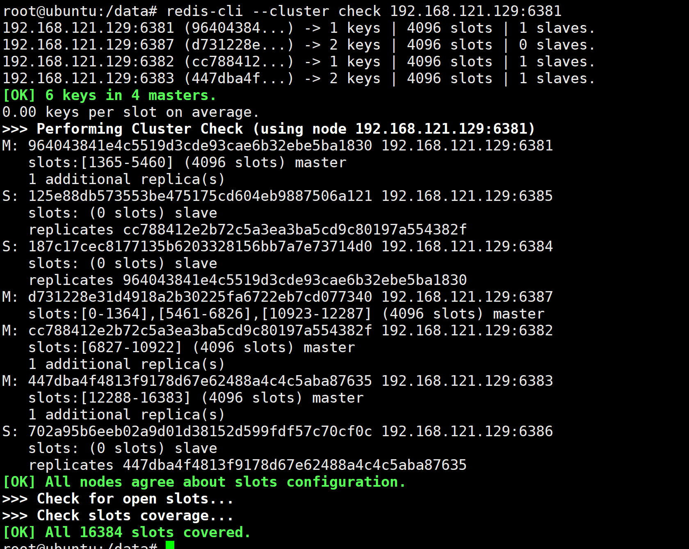
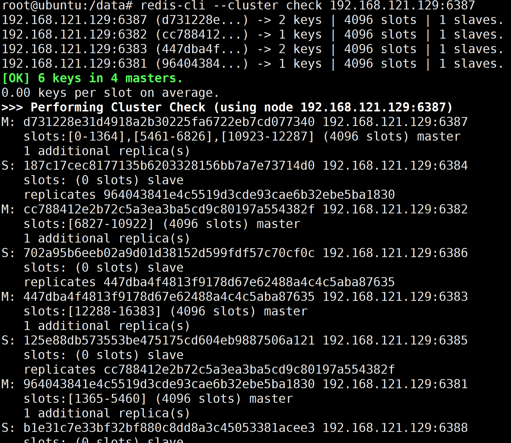

# redis主从扩容

[toc]

**我们再加入结点主机得时候，对于新机加盟会有什么样的变化呢**

​	

### 新建两个结点并且启动

```
docker run -d --name redis-node-7 --net host --privileged=true \
-v /data/redis/share/redis-node-7:/data \
redis:6.0.8 --cluster-enabled yes --appendonly yes --port 6387

docker run -d --name redis-node-8 --net host --privileged=true \
-v /data/redis/share/redis-node-8:/data \
redis:6.0.8 --cluster-enabled yes --appendonly yes --port 6388

docker ps
```


### 将新增的结点7号（空槽）作为master结点加入原集群

**新的结点加入一定要重新洗牌**

```
docker exec -it redis-node-1 /bin/bash
redis-cli --cluster add-node 192.168.121.129:6387 192.168.121.129:6381
#redis-cli --cluster add-node 新结点 原结点
reids-cli --cluster check 192.168.121.129:6381 
```

> slots进行槽位分段


**提醒我们暂时没有槽位（0，0，0），我们开始分配，使用reshard**

```
redis-cli --cluster reshard 192.168.121.129:6381
```

> 上面我们重新分配了一个槽位

**注意：此时我们需要分配槽位**

> How many slots do you want to move (from 1 to 16384)? 
>
> 您想移动多少个槽(从1移动到16384)?

**此时我们需要进行计算16384/4=4096（是四台master）**

**接受的ID需要填6387的ID**

> Do you want to proceed with the proposed reshard plan (yes/no)? 
>
> 你想继续拟议的reshard计划吗(是/否)?



**此时我们发现槽位发生变化，每一家都润了一点给七号**

**所以是以前的区间，前三家各自拿出一部分，这样可以节约分配成本**


### 将8号挂载到7号上面

```
redis-cli --cluster add-node 192.168.121.129:6388 192.168.121.129:6387 \
--cluster-slave --cluster-master-id 7号的编号

redis-cli --cluster check 192.168.121.129:6387
```



**此时扩容成功！！！**
