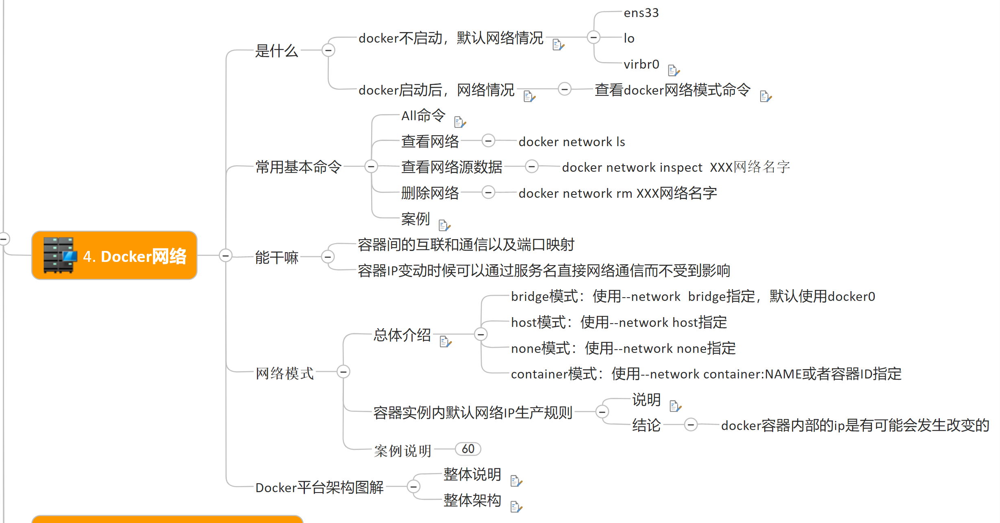

# docker 网络

[toc]

## 开始



**使用redis创建三主三从reids实例的时候**

```
docker run -d --name redis-node-1 --net host --privileged=true \
-v /data/redis/share/redis-node-1:/data \
redis:6.0.8 --cluster-enabled yes --appendonly yes --port 6381
```

`--net host`：网络模式


**在CentOS7的安装过程中如果有选择相关虚拟化的的服务安装系统后，启动网卡时会发现有一个以网桥连接的私网地址的virbr0网卡(virbr0网卡：它还有一个固定的默认IP地址192.168.122.1)，是做虚拟机网桥的使用的，其作用是为连接其上的虚机网卡提供 NAT访问外网的功能。**

我们之前学习Linux安装，勾选安装系统的时候附带了libvirt服务才会生成的一个东西，如果不需要可以直接将libvirtd服务卸载，

```
yum remove libvirt-libs.x86_64
```


## docker启动后，网络情况

**会产生一个名为docker0的虚拟网桥**

```shell
root@ubuntu:/text# ifconfig
docker0: flags=4163<UP,BROADCAST,RUNNING,MULTICAST>  mtu 1500
        inet 172.17.0.1  netmask 255.255.0.0  broadcast 172.17.255.255
        inet6 fe80::42:1cff:fea2:e40d  prefixlen 64  scopeid 0x20<link>
        ether 02:42:1c:a2:e4:0d  txqueuelen 0  (Ethernet)
        RX packets 1018  bytes 47380 (47.3 KB)
        RX errors 0  dropped 0  overruns 0  frame 0
        TX packets 1092  bytes 22527365 (22.5 MB)
        TX errors 0  dropped 0 overruns 0  carrier 0  collisions 0
```


## 查看docker网络命令

```shell
root@ubuntu:/text# docker network --help

Usage:  docker network COMMAND

Manage networks

Commands:
  connect     Connect a container to a network
  create      Create a network
  disconnect  Disconnect a container from a network
  inspect     Display detailed information on one or more networks
  ls          List networks
  prune       Remove all unused networks
  rm          Remove one or more networks

Run 'docker network COMMAND --help' for more information on a command.
```


+ 查看网络

  ```
  docker network ls
  ```

+ 查看网络源数据

  ```
  docker network inspect XXX网络名字
  ```

+ 删除网络

  ```
  docker network rm XXX网络名字
  ```

  


## 作用

**·     容器间的互联和通信以及端口映射**

**·     容器IP变动时候可以通过服务名直接网络通信而不受到影响**