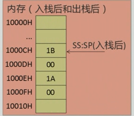
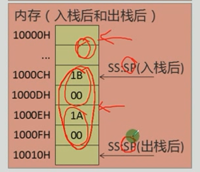
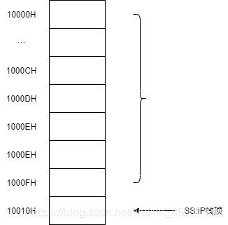
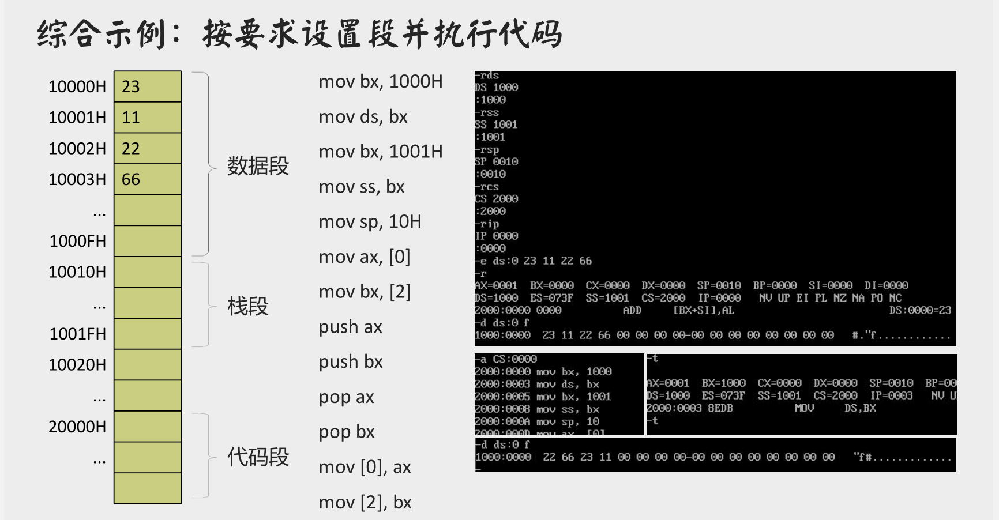

+ [author](https://github.com/3293172751)

# 第10节 栈以及栈操作的实现

+ [回到目录](../README.md)
+ [回到项目首页](../../README.md)
+ [上一节](9.md)
> ❤️💕💕汇编语言目前仍在发挥着不可替代的作用，在效率上无可替代，在底层，学习linux内核，计算机外围设备和驱动，都离不开汇编。Myblog:[http://nsddd.top](http://nsddd.top/)
---
[TOC]

## 栈结构

> 我们都知道,栈只能在一端来进行插入和删除.
>
> + 入栈
> + 出栈
>
> **栈操作规则:`LIFO`**

**我们都认为栈是数据结构中的操作,其实现在CPU都提供栈机制**

+ 如今的CPU都有栈设计
+ 8086CPU提供相关的指令,支持使用栈的方式访问内存空间
+ 基于8086CPU编程,可以将一段内存当作栈来使用


**PUSH(入栈),POP(出栈)指令 **

```
push ax : 将ax中的数据送入栈中
pop ax : 从栈顶取出数据送入ax
```

> 注意上面是以`字`为单位的


**问题**：

1. **CPU 如何知道一段内存空寂爱你被当作栈使用？**

2. **执行执行 push 和 pop 的时候，如何知道哪个单元是栈顶单元？**

   + 8086CPU 中，有两个与栈相关的寄存器：

   ```
   SS（stack segment） 栈段寄存器 - 存放栈顶的段地址
   
   SP（stack pointer） 栈顶指针寄存器 - 存放栈顶的偏移地址
   ```

   任意时刻，`SS:SP`指向栈顶元素

- **PUSH指令（入栈）：** SP = SP - 2   // SS此时指向新栈顶
- **POP指令（出栈）：** SP = SP + 2


## 栈操作

```
mov ax,1000H
mov ss,ax
mov sp,0010
```


**1000:0010 作为栈顶，栈顶上一个存储单元到段的起始存储单元为栈的空间（10000H~1000FH）**

```
mov ax,001AH
mov bx,001BH
```


**入栈操作**

```
push ax    ;//001AH
push bx	   ;//001BH
```




**出栈操作**

```
pop ax
pop bx
```





## debug调试

**先将指令输入**


**调试**


## 越界问题

> 如何保证在操作入栈出栈时候,栈顶不会超出栈空间.
>
> + push出栈顶
> + pop空栈
>
> **称之为栈溢出,这是非常危险的.而且CPU是不对栈空间进行判断**

**物理逻辑：**
根据SP的变化，决定数据栈的更改。
将1000H—100FH这段内存当作栈来使用，此时栈为空。



- 对栈超界问题：

  > 存在两种超出情况：
  >
  > - 底超出
  > - 顶超出

- **注：该超界问题无法被机制控制，只能有操作者自身控制。**


## 段的总结

$$
物理地址 = 段地址 ×16+偏移地址
$$


**到目前为止有三种段:**

+ 数据段
  + 将段地址放入`DS`中
  + 用`mov`,`add`,sub`访问内存单元时候,`CPU`将我们定义的数据段中的内容当作数据段访问
+ 代码段
  + 将段地址放入`CS`中,将段中的第一条指令的偏移地址放入`IP`中
  + `CPU`将执行我们定义的代码段中的指令
+ 栈段
  + 将段地址放入`SS `中,将栈顶单元的偏移地址放在`SP`中
  + `CPU`在需要进行栈操作(PUSH POP)时,就将我们定义的栈段当作栈空间使用


## 使用debug完成数据段 栈段 代码段操作

**设置空间**




**依次输入指令**


**调试**


> 三个段地址是可以一样的


## END 链接

+ [回到目录](../README.md)
+ [上一节](9.md)
+ [下一节](11.md)
---
+ [参与贡献❤️💕💕](https://github.com/3293172751/Block_Chain/blob/master/Git/git-contributor.md)